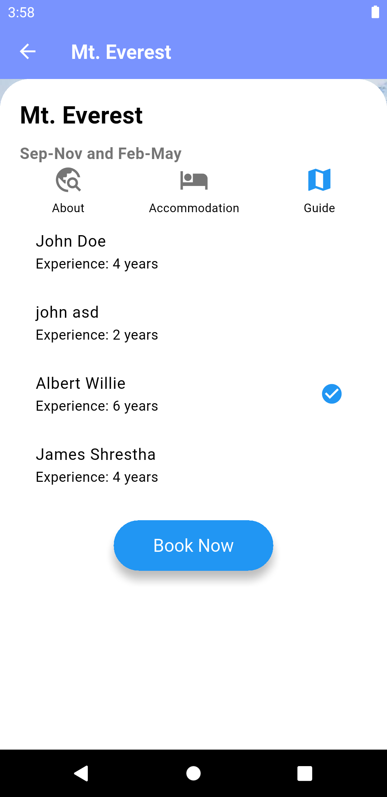

VoyageVue-Travel detail app
Welcome to VoyageVue, a user-friendly travel booking application designed to simplify exploring and booking travel destinations. Whether you're planning a quick getaway or a long adventure, VoyageVue has you covered. The app allows users to securely log in, sign up, and log out, browse curated destinations, book accommodations, add favorite places to a bucket list, filter options by category and destinations offering a seamless and efficient travel planning experience.

Features
-User Authentication
-Destination List (Top destination, More To Explore, and Categories)
-Destiantion Details (with accommodation list and guide list which we will choose to make a booking )
-Bookings (Booking by User Id)
-Schedule (booking schedule)
-Bucketlist (save the next destination to travel) 

//=======Screenshot of the VoyageVue===========

Mobile App View

